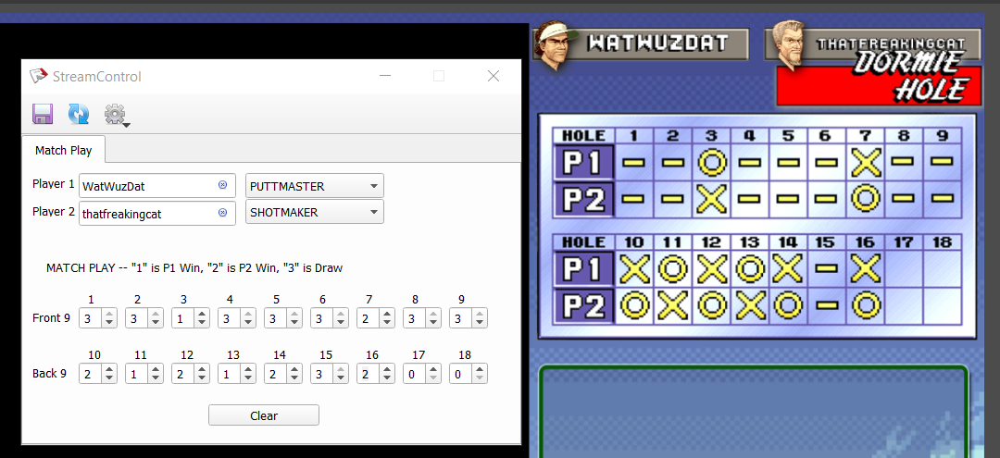

neo-turf-scoreboard
===================
This scoreboard is built using [StreamControl](https://github.com/farpenoodle/StreamControl) from [@farpenoodle](https://github.com/farpenoodle)

Display a match-play scoreboard with player names and characters in your stream! Scoreboard keeps track of holes up and dormies.

How to:

- Grab the latest zip version from [Releases](https://github.com/siemenskyle/neo-turf-scoreboard/releases) and extract it.

- Add the scoreboard.html in the scoreboard folder to your OBS as a browser source
	- Width is somewhat variable, can make it wider and it will float names to the edge of the specified size
	- I used Width at 575 and Height at 600 in the browser source
	
- Use StreamControl.exe to control it

- That's it

Future Work Ideas
-----------------
Feel free to request future ideas in Issues. Some ideas I currently have:
* Sudden death indicator
* Stroke play scorecard (1 player and 2 player)
* Animations
