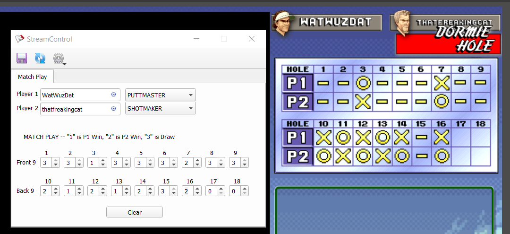
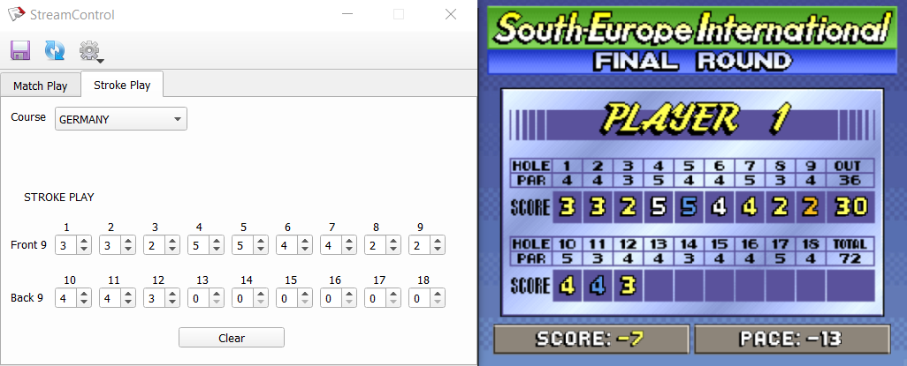

neo-turf-scoreboard
===================
This scoreboard is built using [StreamControl](https://github.com/farpenoodle/StreamControl) from [@farpenoodle](https://github.com/farpenoodle)

Download
--------
- Grab the latest zip version from [Releases](https://github.com/siemenskyle/neo-turf-scoreboard/releases) and extract it.

Match Play
----------
Displays a match play scoreboard with player names and characters. Scoreboard keeps track of holes up and dormies.

- Add the matchPlay.html in the scoreboard/matchPlay folder to your OBS as a browser source
	- Width is somewhat variable, can make it wider and it will float names to the edge of the specified size
	- I used Width at 575 and Height at 600 in the browser source
	
- Open Up StreamControl.exe and use the "Match Play" tab to control it

Stroke Play
----------
Displays a stroke play scorecard with current score and pace. Pace is defined as all holes being a birdie.

How to:

- Add the strokePlay.html in the scoreboard/strokePlay folder to your OBS as a browser source
	- Does not vary in size, just ensure your browser source is large enough for the images
	- Reccomend Width at 600 and Height at 500 in the browser source
	
- Open Up StreamControl.exe and use the "Stroke Play" tab to control it

Future Work Ideas
-----------------
Feel free to request future ideas in Issues. Some ideas I currently have:
* Win indicators
* Stroke play scorecard (2 player)
* Animations
